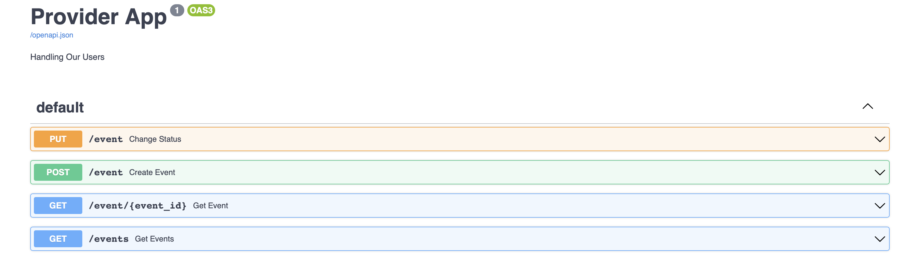
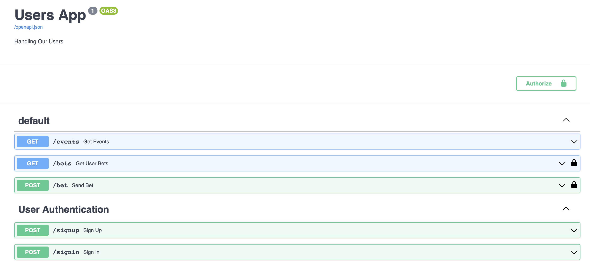

[](https://git.io/typing-svg)

## Used technology
- Python 3.10;
- FastApi ( Web framework for building APIs );
- Docker and Docker Compose ( containerization );
- PostgreSQL ( database );
- SQLAlchemy ( working with database from Python );
- RabbitMQ ( Queue )
- Alembic ( database migrations made easy );
- Pydantic ( models )

<hr/>




<hr/>

### Установка и запуск

1. Клонировать проект в удобное место:

```sh
git clone https://github.com/Whitev2/bet-test-api.git
```

2. Собрать и запустить контейнеры:
```sh
docker-compose build
```
```sh
docker-compose up
```
<hr/>

### Дополнительные команды


1. Создание файла миграций:
```sh
docker-compose exec bet_maker alembic revision --autogenerate -m "init"
```

2. Обновление базы данных:
```sh
docker-compose exec bet_maker alembic upgrade head
```

3. Остановка контейнеров:
```sh
docker-compose down
```

4. Запуск контейнеров:
```sh
docker-compose up
```

<hr/>

### API: Документация

- Provider_URL: http://localhost:8001
- Maker_URL: http://localhost:8000
- 
- Provider Swagger UI: http://localhost:8001/docs
- Maker ReDoc UI: http://localhost:8000/redoc

<hr/>

### Описание функционала
- Сервис позволяет просматривать активные ивенты
- Сервис позволяет делать ставки на активные ивенты
- Сервис позволяет просматривать свои ставки
- Сумма ставки не может быть меньше 0 - иначе будет вызвана ошибка
- Maker получает активные ивенты из Provider через endpoint url
- При изменении состояния со стороны Provider - меняется статус у ставки
- Обмен данными для изменения состояний реализован через aio-pika и RabbitMQ
- Все сервисы собираются в Docker Compose
- Возможна интеграция с k8s

### Что можно доработать
- Покрыть все Юнитами
- Запись в базу должна быть транзакционной и атомарной
- Расставить блокировки чтобы исключить состояние гонки


